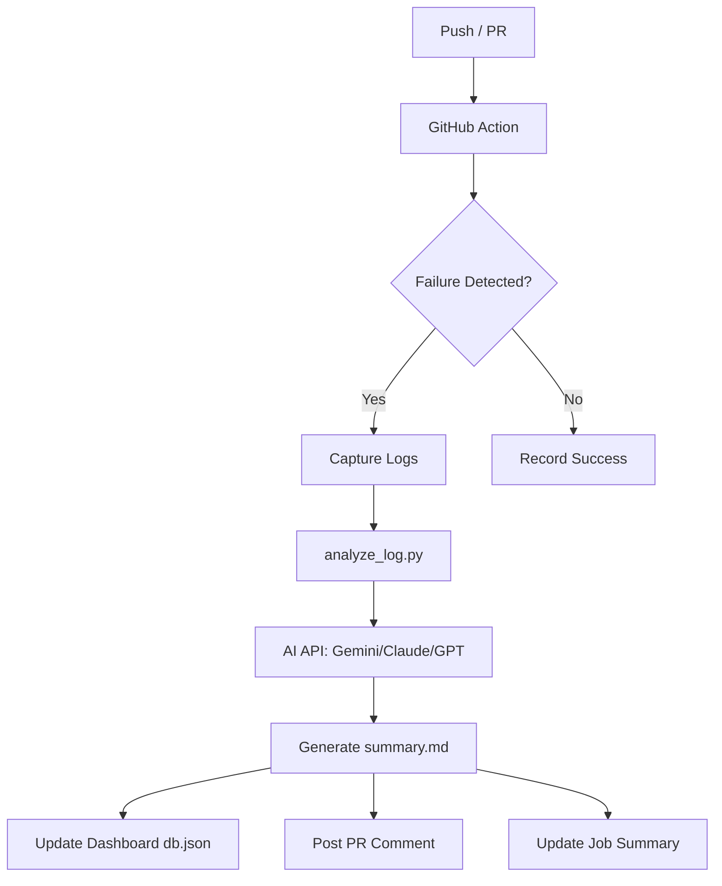

# 🤖 AI-Powered CI/CD Log Analyst

> Transform cryptic CI/CD failure logs into actionable remediation steps instantly using state-of-the-art LLMs.

---

## ✨ Overview

This project provides a seamless, automated pipeline for analyzing build and test failures in GitHub Actions. Instead of digging through thousands of lines of logs, developers receive a concise, AI-generated summary of exactly what went wrong and how to fix it.

### 🚀 Key Capabilities

*   **🔍 Intelligent Failure Capture**: Automatically detects failures in both dependency builds (`pip`, `npm`, etc.) and test suites (`pytest`).
*   **🧠 Multi-Model Intelligence**: Native support for **Gemini 2.0/1.5**, **Claude 3.5**, and **GPT-4o**.
*   **📊 Integrated Dashboard**: A premium, real-time web dashboard to visualize failure trends and remediation history.
*   **💬 Seamless Integration**: 
    *   **PR Comments**: Direct feedback on Pull Requests.
    *   **Job Summaries**: Rich Markdown reports in the GitHub Actions UI.
    *   **Artifacts**: Persistent storage of logs and AI analysis.
*   **🛡️ Robust Design**: Handles rate limits, model availability issues, and encoding mismatches automatically.

---

## 🛠️ Architecture



---

## 🚦 Getting Started

### 1. Configure Secrets
To enable AI analysis, add your preferred API key to your GitHub Repository Secrets (**Settings > Secrets and variables > Actions**):

| Secret Name | Provider | Description |
| :--- | :--- | :--- |
| `GOOGLE_API_KEY` | Google AI Studio | Recommended (Supports Gemini 2.0/1.5) |
| `ANTHROPIC_API_KEY` | Anthropic | For Claude 3.5 Sonnet analysis |
| `OPENAI_API_KEY` | OpenAI | For GPT-4o analysis |

### 2. Local Dashboard Setup
Monitor your CI/CD health from your local machine:

```bash
# Install dependencies
pip install -r requirements.txt

# Start the dashboard server
python run_dashboard.py
```
Visit `http://localhost:8000/dashboard/` to view the interactive analysis portal.

---

## 📁 Project Structure

```text
├── .github/workflows/
│   └── ai-log-analysis.yml  # The automation brain
├── scripts/
│   ├── analyze_log.py       # AI interfacing & logic
│   └── create_ppt.py        # Automated reporting tools
├── dashboard/
│   ├── index.html           # Premium UI
│   └── style.css            # Modern glassmorphism design
├── tests/
│   └── test_demo.py         # Sample tests for validation
└── db.json                  # Persistent failure database
```

---

## 🌟 Demo Case
The repository includes `tests/test_demo.py` which contains intentional failures. This allows you to witness the AI's diagnostic capabilities immediately upon your first workflow run!

---