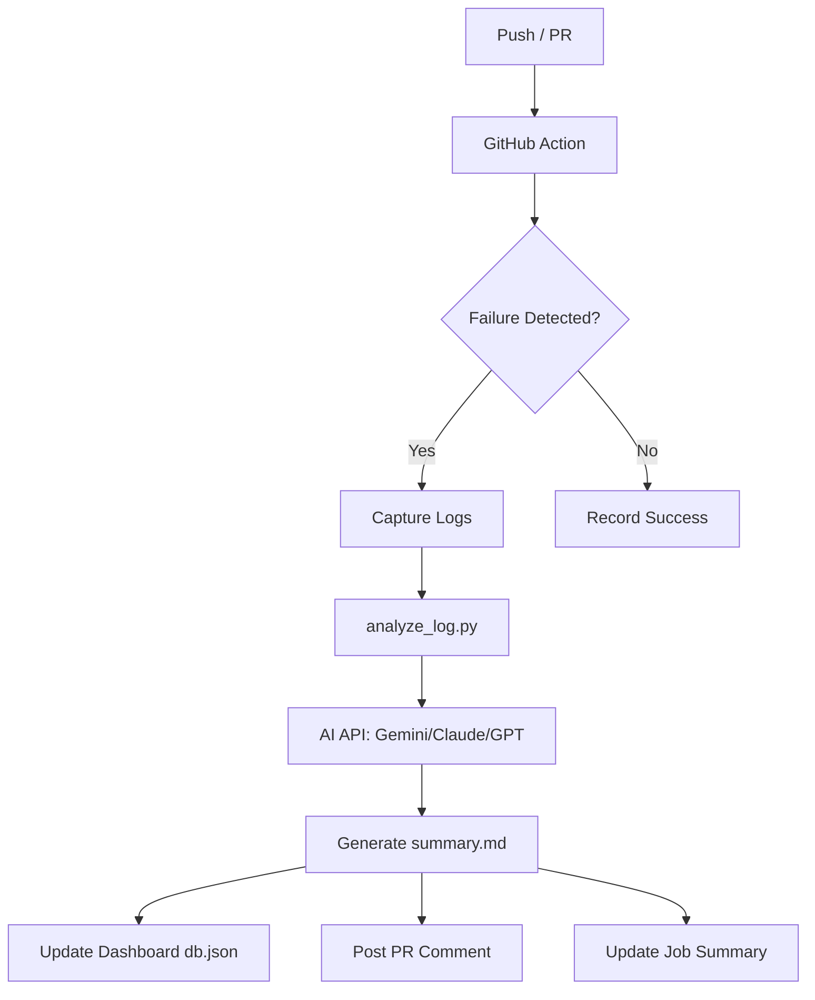

# 🤖 AI-Powered CI/CD Log Analyst

> Transform cryptic CI/CD failure logs into actionable remediation steps instantly using state-of-the-art LLMs.

---

## ✨ Overview

This project provides a seamless, automated pipeline for analyzing build and test failures in GitHub Actions. Instead of digging through thousands of lines of logs, developers receive a concise, AI-generated summary of exactly what went wrong and how to fix it.

### 🚀 Key Capabilities

*   **🔍 Intelligent Failure Capture**: Automatically detects failures in both dependency builds (`pip`, `npm`, etc.) and test suites (`pytest`).
*   **🧠 Multi-Model Intelligence**: Native support for **Gemini 2.0/1.5**, **Claude 3.5**, and **GPT-4o**.
*   **📊 Integrated Dashboard**: A premium, real-time web dashboard to visualize failure trends and remediation history.
*   **💬 Seamless Integration**: 
    *   **PR Comments**: Direct feedback on Pull Requests.
    *   **Job Summaries**: Rich Markdown reports in the GitHub Actions UI.
    *   **Artifacts**: Persistent storage of logs and AI analysis.
*   **🛡️ Robust Design**: Handles rate limits, model availability issues, and encoding mismatches automatically.

---

## 🛠️ Architecture



---

## 🚦 Getting Started

### 1. Configure Secrets
To enable AI analysis, add your preferred API key to your GitHub Repository Secrets (**Settings > Secrets and variables > Actions**):

| Secret Name | Provider | Description |
| :--- | :--- | :--- |
| `GOOGLE_API_KEY` | Google AI Studio | Recommended (Supports Gemini 2.0/1.5) |
| `ANTHROPIC_API_KEY` | Anthropic | For Claude 3.5 Sonnet analysis |
| `OPENAI_API_KEY` | OpenAI | For GPT-4o analysis |

### 2. Local Dashboard Setup
Monitor your CI/CD health from your local machine:

```bash
# Install dependencies
pip install -r requirements.txt

# Start the dashboard server
python run_dashboard.py
```
Visit `http://localhost:8000/dashboard/` to view the interactive analysis portal.

---

## 📁 Project Structure

```text
├── .github/workflows/
│   └── ai-log-analysis.yml  # The automation brain
├── scripts/
│   ├── analyze_log.py       # AI interfacing & logic
│   └── generate_service_logs.py # Simulation tools
├── dashboard/               # Web UI assets
├── tests/
│   ├── test_demo.py         # Standard failures
│   └── test_complex.py      # Real-world scenarios
├── db.json                  # Failure database
└── run_local_demo.py        # One-click simulation
```

---

## 📊 Where to Find Reports

The system generates reports in multiple locations depending on where it's running:

### 🏠 Local Environment
*   **`summary.md`**: The latest AI-generated diagnostic report in Markdown format.
*   **Interactive Dashboard**: Run `python run_dashboard.py` and visit `http://localhost:8000/dashboard/`.
*   **`db.json`**: The persistent database containing the history of all analyzed failures.

### ☁️ GitHub Actions
*   **Job Summary**: Click on any workflow run to see the "AI Log Analysis" section at the bottom of the page.
*   **PR Comments**: If triggered by a Pull Request, the AI posts its findings directly as a comment.
*   **Artifacts**: Download the `ai-analysis-results` package from the workflow run for the full logs and summary.

---

## 🌟 Demo Guide

### 1. Simple Validation
The repository includes `tests/test_demo.py` which contains intentional failures. This allows you to witness the AI's diagnostic capabilities immediately upon your first workflow run.

### 2. Complex Failure Scenarios
See how the AI handles API timeouts, database deadlocks, and resource exhaustion:
```bash
python -m pytest tests/test_complex.py > complex_tests.log
python scripts/analyze_log.py complex_tests.log
```

### 3. Simulated Service Logs
Generate and analyze logs that look like a real production backend service:
```bash
# Generate a realistic service.log
python scripts/generate_service_logs.py

# Analyze the generated logs
python scripts/analyze_log.py service.log
```

---

## 💡 Troubleshooting

### API Rate Limits (429 Error)
If you see a `RESOURCE_EXHAUSTED` error in the logs, it means you have hit the rate limit for that specific model (common on free tiers). The script is designed to **automatically fall back** to other available models (like `gemini-1.5-flash`) to ensure the analysis still completes.

